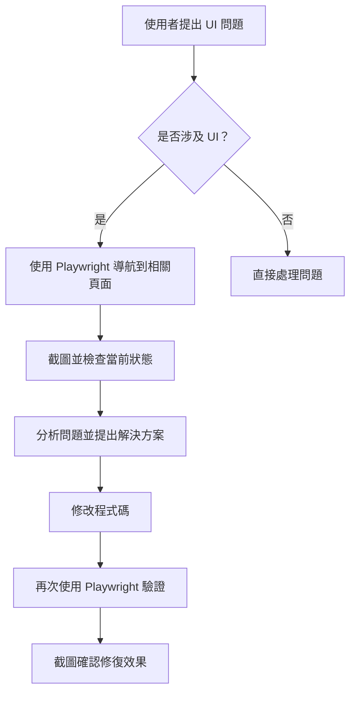

# AI 協助開發工作流程指南

> 本文件定義 AI 協助開發時必須遵循的工作流程和檢查規範

## 🎯 核心原則

### 1. UI 問題必須使用 Playwright MCP 驗證

**規則**：當使用者提出任何與 UI 相關的問題、修改或疑慮時，AI 必須使用 Playwright
MCP 工具進行實際確認。

#### 適用情境

- ✅ 樣式問題（文字大小、padding、顏色等）
- ✅ 佈局問題（對齊、間距、響應式設計）
- ✅ 互動問題（按鈕點擊、表單驗證、錯誤顯示）
- ✅ 視覺效果（動畫、過渡效果、hover 狀態）
- ✅ 跨頁面一致性（比較不同頁面的樣式）

#### 工作流程



#### Playwright MCP 工具使用

1. **導航到頁面**

   ```javascript
   mcp_cursor -
     playwright_browser_navigate({ url: 'http://localhost:3000/...' })
   ```

2. **獲取頁面快照**

   ```javascript
   mcp_cursor - playwright_browser_snapshot()
   ```

3. **截圖確認**

   ```javascript
   mcp_cursor -
     playwright_browser_take_screenshot({
       filename: 'descriptive-name.png',
     })
   ```

4. **互動測試**
   ```javascript
   mcp_cursor - playwright_browser_click({ element: '...', ref: '...' })
   ```

#### 範例場景

**場景 1：使用者報告「按鈕大小不一致」**

```
1. 使用 Playwright 導航到相關頁面
2. 截圖當前狀態
3. 檢查 DOM 結構和樣式
4. 修改程式碼
5. 刷新頁面並再次截圖
6. 比對修改前後的差異
```

**場景 2：使用者詢問「登入頁面和註冊頁面的輸入框樣式是否一致？」**

```
1. 導航到登入頁面並截圖
2. 導航到註冊頁面並截圖
3. 比較兩個頁面的樣式
4. 如有差異，提出統一方案
5. 修改後再次驗證
```

---

## ⚠️ 程式碼提交前強制檢查流程

### 步驟 1：執行 Linting 檢查

```bash
yarn lint
```

**目的**：

- 檢查程式碼風格是否符合專案規範
- 發現潛在的程式碼問題（unused variables, import errors 等）
- 確保 import 順序正確（`simple-import-sort` 規則）

**常見問題與解法**：

1. **Import 順序錯誤**

   ```bash
   yarn lint --fix  # 自動修復 import 順序
   ```

2. **Unused variables**
   - 移除未使用的變數
   - 或使用 `// eslint-disable-next-line no-unused-vars` 註釋（需要充分理由）

### 步驟 2：執行 Build 檢查

```bash
yarn build
```

**目的**：

- 確保專案可以成功建置
- Next.js build 會執行更嚴格的類型和語法檢查
- 驗證所有 import 路徑正確
- 檢查 Server/Client Component 使用是否正確

**常見問題與解法**：

1. **環境變數缺失**

   - 檢查 `.env.local` 是否包含所有必要變數

2. **模組解析失敗**

   - 檢查 import 路徑是否正確
   - 確認 `@/` alias 設定正確
   - 驗證檔案確實存在於指定位置

3. **Client Component 使用錯誤**
   - 確保使用 React Hooks 的組件有 `'use client'` 宣告
   - Server Component 不能使用 `useState`, `useEffect` 等 hooks

### 步驟 3：全部通過才能提交

**成功標準**：

- ✅ `yarn lint` 執行成功 (Exit code: 0)
- ✅ `yarn build` 執行成功 (Exit code: 0)
- ✅ 只有 warnings 可以接受（errors 必須修復）

**失敗處理**：

1. 詳細分析錯誤訊息
2. 根據專案架構規範提出最佳解決方案
3. 修復所有錯誤
4. 重新執行步驟 1 和 2
5. 確認全部通過後才提交程式碼

---

## 📋 檢查清單範本

在每次開發完成後，確認以下項目：

```markdown
- [ ] 執行 `yarn lint` - 通過
- [ ] 執行 `yarn lint --fix` - 自動修復可修復的問題
- [ ] 執行 `yarn build` - 通過
- [ ] 檢查並修復所有 Error（Warnings 可接受）
- [ ] 驗證新增/修改的檔案符合專案架構
- [ ] 確認 import 路徑使用 `@/` alias
- [ ] 檢查是否有未使用的 import 或變數
- [ ] **如涉及 UI 修改，使用 Playwright MCP 驗證**
```

---

## 🚫 絕對不可以

- ❌ 跳過 lint 或 build 檢查就提交程式碼
- ❌ 使用 `// eslint-disable` 來隱藏應該修復的問題
- ❌ 提交有 Error 的程式碼（Warnings 可以，但要有充分理由）
- ❌ 假設「應該沒問題」而不實際執行檢查
- ❌ 依賴 `read_lints` 工具而不執行完整的 `yarn lint` 和 `yarn build`
- ❌ **UI 問題不使用 Playwright MCP 進行實際驗證**

---

## 💡 最佳實踐

### 開發過程中隨時檢查

- 完成一個小功能就執行一次 lint
- 不要等到全部開發完才檢查

### 使用 lint --fix 自動修復

- 大部分格式問題可以自動修復
- 節省手動調整時間

### 理解錯誤訊息

- 不要只是消除錯誤，要理解為什麼會有錯誤
- 學習如何預防類似問題

### UI 驗證要徹底

- 修改前截圖
- 修改後截圖
- 比對確認修復效果
- 測試不同視窗大小（響應式）
- 測試錯誤狀態、hover 狀態等

---

## 📚 相關文件

- [UI Framework Policy](../.cursor/rules/ui-framework-policy.mdc) -
  UI 組件庫使用政策
- [Migration from MUI](./MIGRATION_FROM_MUI.md) - Material-UI 遷移計劃

---

**最後更新**：2025-10-19  
**維護者**：Paper Hsiao (@paperhsiaooo)
